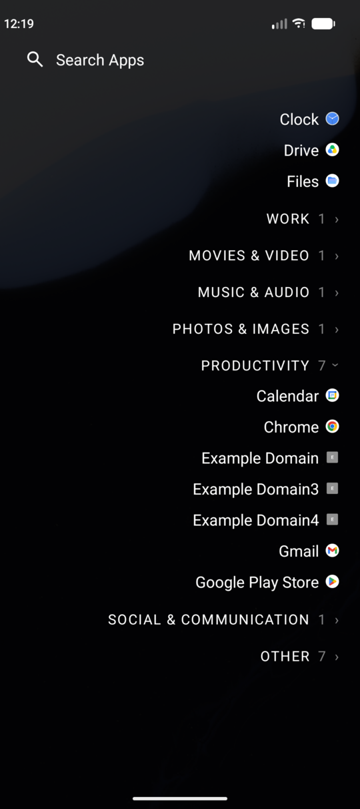
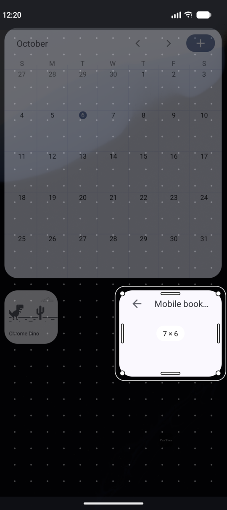

# Fork Development Notes

**Dil / Language:** [Türkçe](#tr) · [English](#en)

---

## Türkçe

Değişiklikler 3 kategoride yapılıyor:

- **A – Güvenlik**
- **B – Hata düzeltmeleri**
- **C – Keyfî GUI tasarımı**

Bu dosya, Panther Launcher'ın kaynağı olan [mLauncher (Multi Launcher)](https://github.com/CodeWorksCreativeHub/mLauncher) projesinden hangi noktalarda ayrıldığının özetidir. Ayrıntılar git geçmişindedir.

### A – Güvenlik

- Çökme kaydını `crash.5646316.xyz` sunucusuna gönderen, devre dışı duran kod tamamen silindi.
- Çökme raporu e-postası artık kaynak projenin geliştiricisine gitmiyor; alıcıyı kullanıcı yazar.
- Eski alan adına (`5646316.xyz`) giden tema indirme ve gizlilik politikası bağlantıları kaldırıldı.
- Uygulama kilidi artık kalıcı: ilkinden sonraki kilit değişiklikleri kaydedilmiyor, launcher yeniden başlayınca kayboluyordu.
- Kilitli uygulamalar ana ekrandaki hızlı erişim düğmeleri ve tarih dokunuşu üzerinden doğrulamasız açılamıyor.
- Cihazda ekran kilidi yoksa uygulama kilitlenemiyor; önceden böyle kilitlenen uygulama sessizce açılmaz hale geliyordu.
- Erişilebilirlik servisi artık ekran içeriğini okuma yetkisi istemiyor ve bildirim metinlerini kayda yazmıyor.
- Widget'lar artık sahibi uygulamanın kodu launcher'a yüklenmeden gösteriliyor ve başka uygulamadan dönen widget kimliğine güvenilmiyor.
- Gizlenen uygulamalar, bir uygulama sabitlendiğinde çekmeceye ve aramaya geri dönmüyor.
- Başka bir uygulamanın gönderdiği sahte "ikon paketi uygula" isteği yok sayılıyor; paket adı sistemden okunuyor ve pencere kapatılabiliyor.
- İçe aktarılan tema yalnızca renk ayarlarını değiştirebiliyor; bozuk bir tema ya da yedek dosyası launcher'ı artık açılışta çökertmiyor.
- Hava durumu için konum yaklaşık 1 km hassasiyetle gönderiliyor, hassas konum izni kaldırıldı ve koordinatlar kayda yazılmıyor.
- Çökme kaydı ortak Download klasörü yerine uygulamanın özel alanında tutuluyor ve açılan uygulamaların adını içermiyor.
- Launcher verileri bulut yedeğine gitmiyor; notlar ekran görüntüsüne çıkmıyor, rehber önbelleği izin kalkınca siliniyor ve e-posta adresleri okunmuyor.
- Derleme kararlı Kotlin sürümüyle, geliştirici depoları olmadan ve Gradle indirmesi sağlama toplamıyla sabitlenerek yapılıyor.
- Eşleşme olmayınca aramanın Play Store'a veya bir web arama motoruna gönderilmesi, internet arama düğmesi ve arama motoru ayarı kaldırıldı; çekmeceye yazılanlar cihaz dışına çıkmıyor.

### B – Hata düzeltmeleri

- Hızlı art arda iki kaydırmadan sonra çekmecenin kalıcı olarak açılmaz hale gelmesi giderildi.
- Çekmece artık yalnızca aşağı çekilince kapanıyor; art arda kaydırmalarda açılıp kapanmıyor.
- Yeniden adlandırılan uygulamanın takma adı artık ana ekranda her modda görünüyor.
- Yavaş yapılan kaydırma hareketleri artık doğru algılanıyor.
- Ana ekrandaki uygulamalar dokunur dokunmaz açılıyor; 0,3 saniyelik bekleme kalktı.
- "Sistemi izle" teması, koyu mod zamanlanmış ya da otomatik olduğunda da doğru çalışıyor.
- Gizlenen uygulamalar, "Son kullanılanları göster" açıkken artık çekmecede ve aramada görünmüyor.
- Türkçe çevirideki 349 metnin 106'sı düzeltildi.
- Her uygulama güncellemesinden önce tüm ayarların otomatik bir kopyası alınıyor (son 5 tanesi saklanır) ve Ayarlar → Yedekle/Geri yükle altından geri yüklenebiliyor; kaynak projede güncellemeler ayarları silebiliyordu.
- Widget'ların yeri ve boyutu yalnızca ızgara hücresi olarak saklanıyor; her açılışta kayma, ekran döndürmede bozulma ve eski boyutun kaydedilmesi giderildi.
- Widget'lar üst üste binmiyor ve sayfanın dışına taşmıyor; dolu yere bırakılan widget eski yerine dönüyor, sayfa doluyken uyarı çıkıyor.
- Yeni widget, uygulamasının istediği boyutla ekleniyor ve gerçek boyutu kendisine doğru bildiriliyor; varsayılanın altına da küçültülebiliyor.
- "Tüm widget'ları kaldır" çökmesi, boyutlandırmadan çıkışta sayfanın yeniden başlaması ve yavaş sürüklerken menünün açılması giderildi.
- Hiç açılmamış bir uygulamanın widget'ı eklenirken, Android bu uygulamaları durdurulmuş saydığı için widget'ın boş kalabileceği söyleniyor ve uygulama tek dokunuşla açılabiliyor.
- Widget seçici tüm widget'ları listeliyor, ayar ekranları Android'in widget'lar için ayırdığı yoldan açılıyor ve widget kimliği artık uygulamanın adına bağlı değil.
- Kategori görünümünde liste yenilenirken (ör. uygulama sabitlenince) arama sonuçlarının tüm listeyle değiştirilmesi giderildi.

### C – Keyfî GUI tasarımı

<table>
  <tr>
    <td align="center"></td>
    <td align="center"></td>
  </tr>
  <tr>
    <td align="center">Çekmecede kategori görünümü</td>
    <td align="center">Widget boyutlandırma</td>
  </tr>
</table>

- Adın uzunluğuna bağlı olmayan, kelime başlarını ve tek harflik yazım hatalarını eşleştiren "Akıllı arama" eklendi; kapatılınca eski arama geri geliyor.
- Çekmecedeki arama alanı büyütüldü ve listeyle arasına boşluk eklendi.
- Çekmeceye kategori görünümü eklendi: sabitlenmiş uygulamalar üstte, diğerleri aynı anda yalnızca biri açılan kategorilerde; her uygulama tek yerde görünür ve kapatılınca A–Z listesi geri gelir.
- Kategoriler önce uygulamaya verilen etiketten, yoksa uygulamanın Android'e bildirdiği kategoriden oluşur; kalanlar "Diğer"e girer.
- Kategori başlıklarının boyutu, rengi, büyük harf ve sayı gösterimi ile arama alanının yüksekliği ve altındaki boşluk ayarlardan değiştirilebilir.
- Günün Sözü tüm parçalarıyla kaldırıldı.
- Uygulamanın adı "Panther Launcher", kimliği `app.pantherlauncher` oldu.
- Yeni logo: siyah üzerine beyaz, Cormorant Garamond (açık lisanslı) ile yazılmış "PanTher"; uyarlanabilir uygulama simgesi olarak da kullanılıyor.
- Widget düzenleme görünümü yenilendi: ince çerçeve, küçük tutamaçlar, canlı boyut etiketi, noktalı ızgara ve kesik çizgili bırakma önizlemesi.
- Logonun açık ve koyu tema için ters renkli iki sürümü var; bildirim simgesi, açılış ekranı ve "Launcher Dots" stili de yeni logoyu kullanıyor.
- Launcher artık kendi uygulama listesinde görünüyor; dokununca ayarları açılıyor.
- Hakkında ekranından bağış, Discord ve "Uygulamayı Paylaş" bağlantıları kaldırıldı.
- Çekmece görünümü (A–Z liste / Kategoriler) ve arama kapsamı artık açma-kapama yerine açılır listeden seçiliyor.
- Çekmece araması cihaz içinde kademeli çalışıyor: uygulama eşleşmezse dosyalar, dosya da yoksa kişiler listeleniyor, hiçbiri yoksa "Bulunamadı" yazıyor; gereken izin yoksa listede tek dokunuşla izin veren bir satır çıkıyor.
- Ayarlara "Kategorileri Yönet" ekranı eklendi: kategoriler yeniden adlandırılıyor, yeni kategori açılıp uygulamaları seçiliyor, kategorilerin üstünde duran uygulamalar ve en fazla kategori sayısı (fazlası "Diğer"e katılır) belirleniyor.
- Ayarların giriş ekranı yeniden tasarlandı: ekrana sığan 2 sütunlu ince kenarlıklı kartlar (yalnızca simge ve başlık; sıra: Özellikler, Görünüm, Hareketler, Ana Ekran Uygulamaları, Gizli Uygulamalar, Notlar, Özel Alan, Gelişmiş), en altta sabit "ad · sürüm · Hakkında" satırı; alt ekranlarda her bölüm ince kenarlıklı bir kartta toplanıyor, Gelişmiş'teki eylemler küçük kartlar ve Uzman seçenekleri aynı ekranın altında bir anahtarla açılıp kapanıyor ("Favori Uygulamalar" adı "Ana Ekran Uygulamaları" oldu, Hakkında'ya 5 dokunuş kalktı).

---

## English

Changes are made in 3 categories:

- **A – Security**
- **B – Bug fixes**
- **C – Discretionary GUI design**

This file summarises where Panther Launcher departs from its source, [mLauncher (Multi Launcher)](https://github.com/CodeWorksCreativeHub/mLauncher). The details are in the git history.

### A – Security

- The disabled code that uploaded crash logs to the `crash.5646316.xyz` server was deleted entirely.
- The crash report e-mail no longer goes to the source project's developer; the user enters the recipient.
- The theme download and privacy policy links to the old domain (`5646316.xyz`) were removed.
- The app lock is now persistent: lock changes after the first one were not saved and were lost when the launcher restarted.
- Locked apps can no longer be opened without authentication through the home screen quick-action buttons or the date tap.
- An app cannot be locked when the device has no screen lock; previously an app locked that way silently became impossible to open.
- The accessibility service no longer asks for permission to read screen content, and notification text is no longer written to the log.
- Widgets are now shown without loading the code of the app that owns them into the launcher, and a widget id returned by another app is no longer trusted.
- Hidden apps no longer return to the drawer and to search when an app is pinned.
- A fake "apply icon pack" request sent by another app is ignored; the pack's name is read from the system and the dialog can be dismissed.
- An imported theme can only change colour settings; a broken theme or backup file no longer crashes the launcher on start.
- For the weather, the location is sent with about 1 km precision, the precise-location permission was removed and coordinates are not logged.
- The crash log is kept in the app's private storage instead of the shared Download folder and no longer names the apps that were opened.
- Launcher data is not sent to cloud backup; notes stay out of screenshots, the contact cache is deleted when the permission is withdrawn and e-mail addresses are not read.
- The build uses the stable Kotlin release, no development repositories, and a checksum-pinned Gradle download.
- Sending a search without a match to the Play Store or a web search engine, the internet search button and the search engine setting were removed; what is typed into the drawer does not leave the device.

### B – Bug fixes

- The drawer no longer becomes permanently impossible to open after two swipes in quick succession.
- The drawer now closes only when pulled down, so it no longer opens and closes on repeated swipes.
- A renamed app's alias is now shown on the home screen in every mode.
- Slow swipe gestures are now detected correctly.
- Apps on the home screen open as soon as they are tapped; the 0.3-second wait is gone.
- The "follow system" theme now also works when dark mode is scheduled or automatic.
- Hidden apps no longer appear in the drawer or in search when "Show recent apps" is on.
- 106 of the 349 strings in the Turkish translation were corrected.
- Before every app update an automatic copy of all settings is taken (the last 5 are kept) and can be restored under Settings → Backup/Restore; in the source project updates could wipe the settings.
- A widget's place and size are stored as grid cells only; drifting on every open, breaking on rotation and saving the old size are fixed.
- Widgets no longer overlap or leave the page; a widget dropped on taken cells returns to its place, and a warning is shown when the page is full.
- A new widget is added at the size its app asks for and is told its real size correctly; it can also be made smaller than its default.
- The "Remove all Widgets" crash, the page restart when leaving resize mode and the menu opening during a slow drag are fixed.
- When a widget of an app that has never been opened is added, the launcher explains that Android keeps such apps stopped and the widget may stay empty, and offers to open the app.
- The widget picker lists every widget, configure screens are opened the way Android intends for widgets, and the widget host id no longer depends on the app's name.
- In the category view the search results are no longer replaced by the full list when the list is refreshed (for example after pinning an app).

### C – Discretionary GUI design

<table>
  <tr>
    <td align="center"></td>
    <td align="center"></td>
  </tr>
  <tr>
    <td align="center">Category view in the drawer</td>
    <td align="center">Resizing a widget</td>
  </tr>
</table>

- "Smart Search" was added: it does not depend on the length of the name and matches word beginnings and single-letter typos; switching it off brings back the previous search.
- The search area in the drawer was enlarged and a gap was added between it and the list.
- A category view was added to the drawer: pinned apps on top, the rest in categories of which only one is open at a time; every app appears in one place, and switching it off brings back the A–Z list.
- Categories come from the tag given to an app, otherwise from the category the app declares to Android; what is left goes to "Other".
- The size, colour, capitalisation and app count of the category headers, and the height of the search area and the space below it, can be changed in the settings.
- Word of the Day was removed with all its parts.
- The app is now named "Panther Launcher" with the ID `app.pantherlauncher`.
- New logo: "PanTher" in white on black, set in Cormorant Garamond (open licence); it is also used as an adaptive app icon.
- The widget editing view was redesigned: thin outline, small handles, live size label, dotted grid and a dashed landing preview.
- The logo has two versions with inverted colours for the light and dark theme; the toast icon, splash screen and "Launcher Dots" style use the new logo as well.
- The launcher now appears in its own app list; tapping it opens its settings.
- Donation, Discord and "Share Application" links were removed from the About screen.
- The drawer view (A–Z list / Categories) and the search scope are now chosen from selection lists instead of toggles.
- The drawer search works in stages on the device: when no app matches it lists files, when no file matches it lists contacts, and otherwise shows "Not found"; a missing permission appears as a row in the list that asks for it with one tap.
- A "Manage Categories" settings screen was added: categories can be renamed, new ones created with their apps chosen, and the apps kept above the categories as well as the maximum number of categories (the rest join "Other") can be set.
- The settings home screen was redesigned: two columns of thin-outlined cards that fit the screen (icon and title only; order: Features, Look & Feel, Gestures, Home Screen Apps, Hidden Apps, Notes, Private Space, Advanced) with a fixed "name · version · About" line at the bottom; on the sub-screens every section sits in an outlined card, the actions in Advanced are small cards and the expert options open and close with a switch at the bottom of that same screen ("Favorite Apps" is now "Home Screen Apps", the five taps on About are gone).
