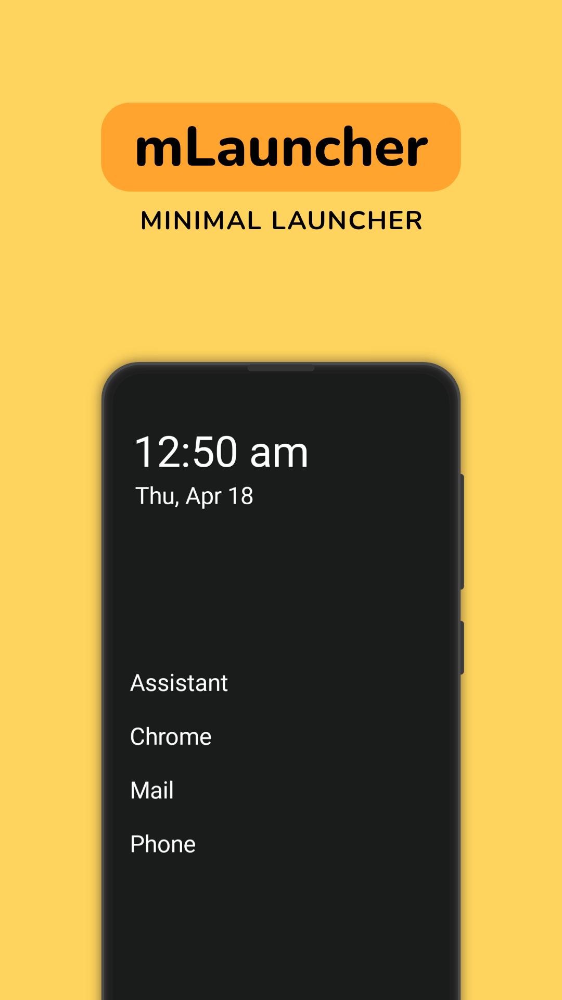
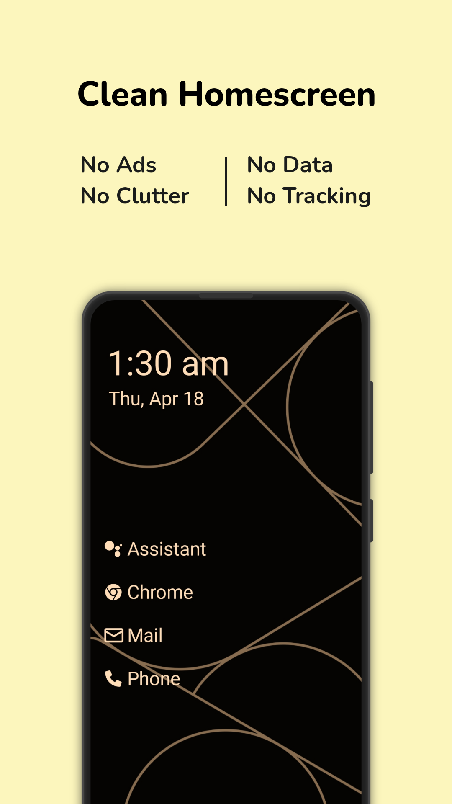
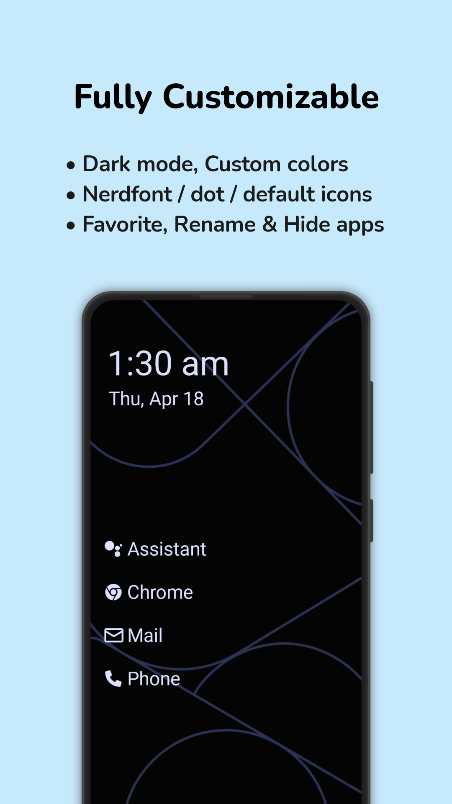
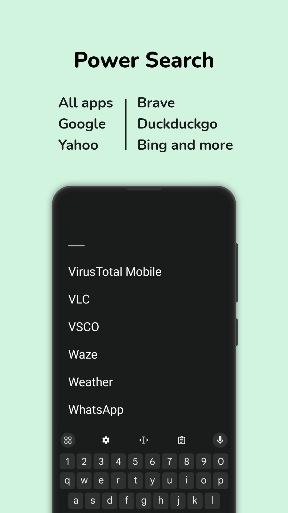
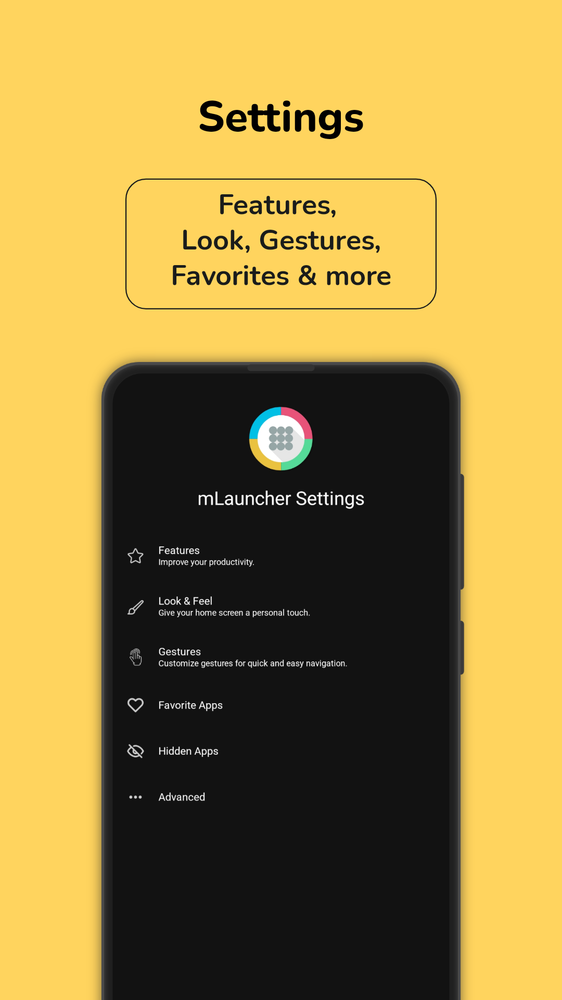
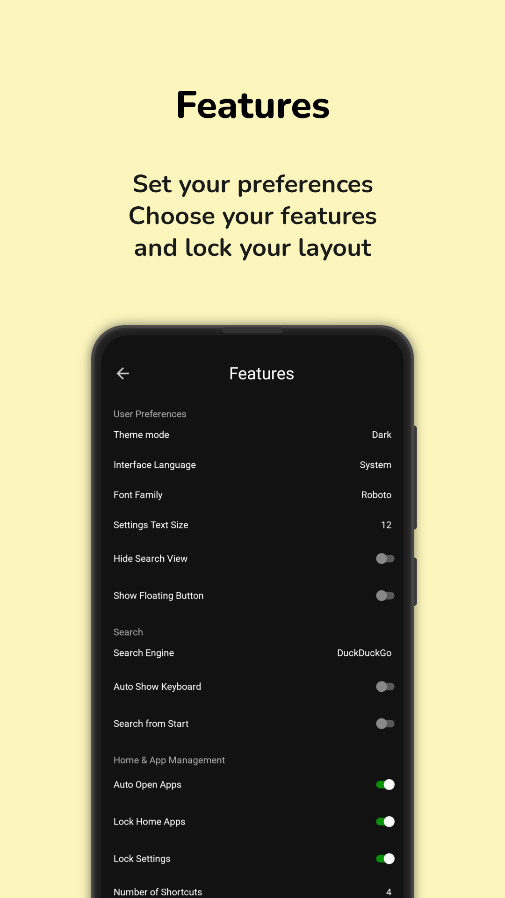
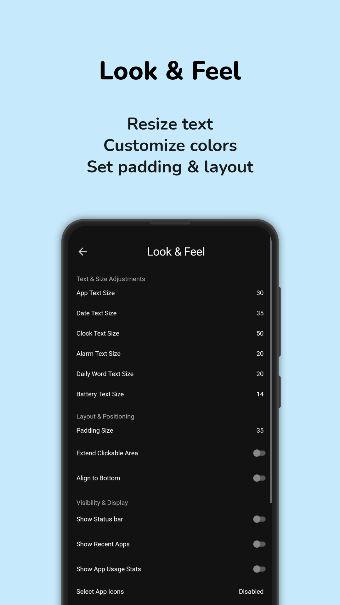
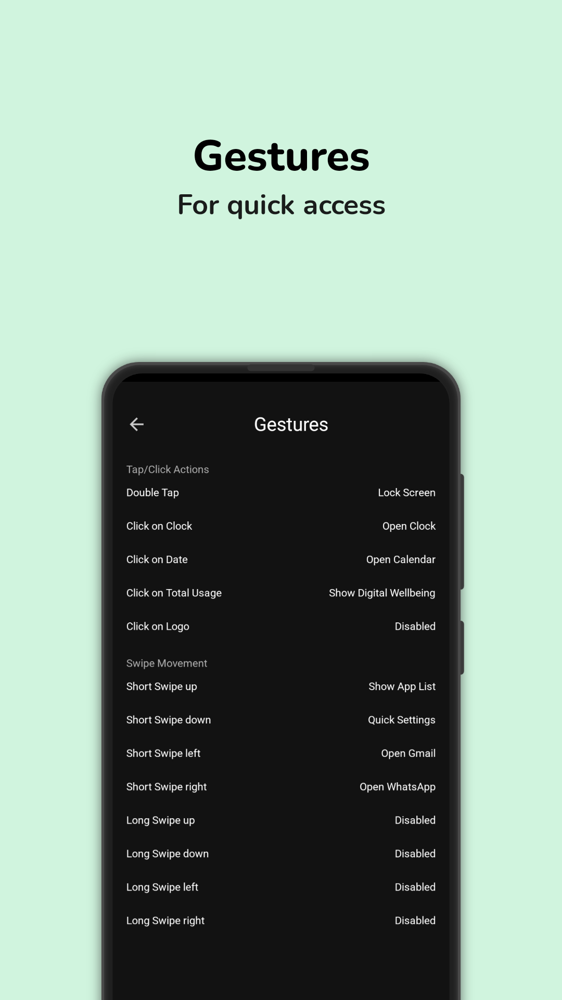

<div align='center'>
	<h2>Panther Launcher</h2>
	<p>Sade ve dağınıklıktan uzak bir Android başlatıcısı.</p>
	<table align='center'>
		<tr>
			<td></td>
			<td></td>
			<td></td>
			<td></td>
		</tr>
		<tr>
			<td></td>
			<td></td>
			<td></td>
			<td></td>
		</tr>
	</table>
</div>

## Bu proje hakkında

Bu proje **SmartKraft // seu** tarafından, herhangi bir dağıtım amacı güdülmeden ve keyfî olarak, yalnızca kendi kullanımım için geliştirilmektedir.

- İsteyen herkes projeyi çatallayıp (fork) kendisi kullanabilir.
- APK dışında dağıtım yapılmayacaktır; uygulama herhangi bir mağazada yer almaz.
- Geliştirmek veya dağıtmak isterseniz bunu kendi deponuzda yapın. Bu depoda issue ve pull request takibi yapılmaz.

Kolay gelsin.

**Kaynak:** [mLauncher (Multi Launcher)](https://github.com/CodeWorksCreativeHub/mLauncher)

### About this project (English)

This project is developed by **SmartKraft // seu** at my own discretion and solely for my own use, with no intention of distributing it.

- Anyone is welcome to fork it and use it themselves.
- Nothing other than an APK will be distributed; the app is not published on any store.
- If you want to develop or distribute it, do so in your own repository. Issues and pull requests are not tracked here.

**Source:** [mLauncher (Multi Launcher)](https://github.com/CodeWorksCreativeHub/mLauncher)

## Derleme

```
./gradlew assembleProdDebug
```

İmzalı sürüm derlemesi için anahtar deposunu `app/pantherlauncher.jks` konumuna koyun ve `KEY_STORE_PASSWORD`, `KEY_ALIAS`, `KEY_PASSWORD` ortam değişkenlerini tanımlayın:

```
./gradlew assembleProdRelease
```

## Temalar ve Günün Sözü

Hazır temalar [themes/](themes/), Günün Sözü dosyaları [wordoftheday/](wordoftheday/) klasöründedir.

## Emeği geçenler

Panther Launcher, aşağıdaki projelerin üzerine kuruludur:

- [mLauncher (Multi Launcher)](https://github.com/CodeWorksCreativeHub/mLauncher) — bu deponun doğrudan kaynağı
- [OlauncherCF](https://github.com/OlauncherCF/OlauncherCF)
- [Olauncher](https://github.com/tanujnotes/Olauncher)

Çatallanma noktasına kadarki değişiklik geçmişi [CHANGELOG.md](CHANGELOG.md) dosyasındadır.

## Lisans

Panther Launcher, kaynağı olan mLauncher gibi [GPL-3.0](LICENSE) lisansı altındadır. Özgün telif hakkı bildirimleri lisans gereği korunmuştur.
